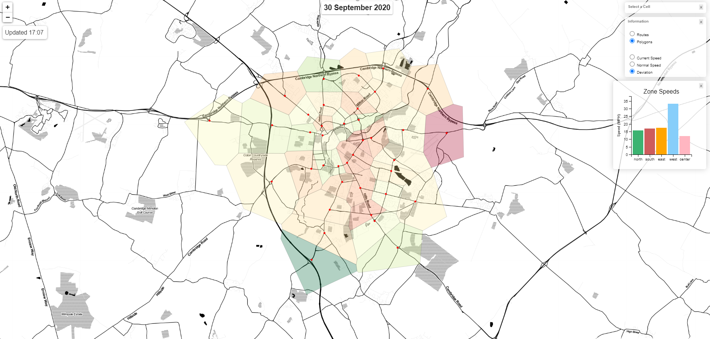
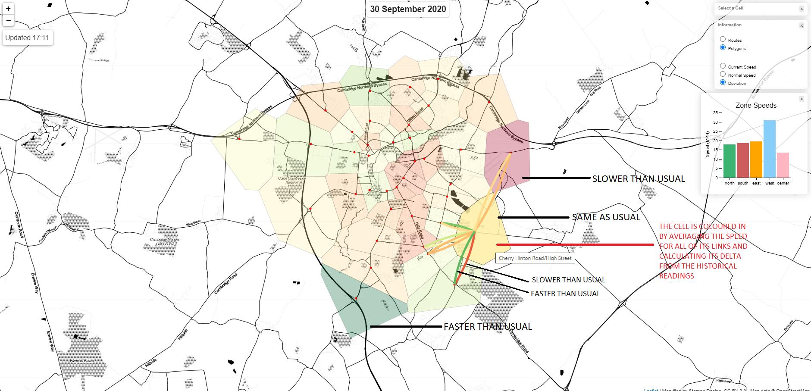
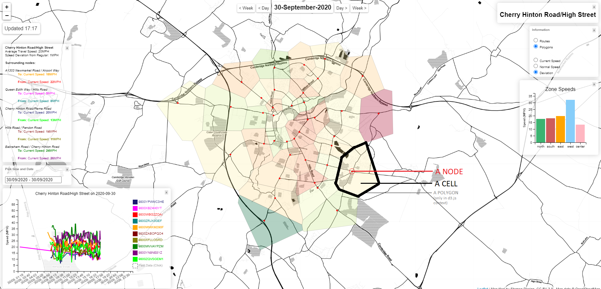
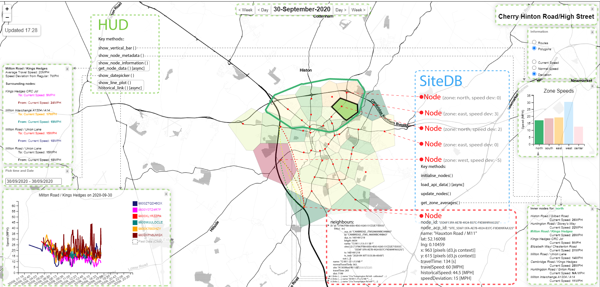
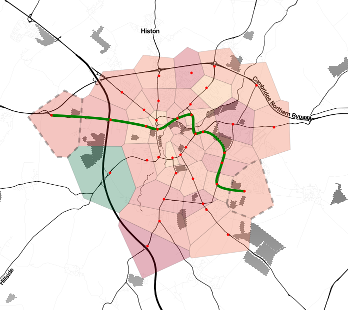
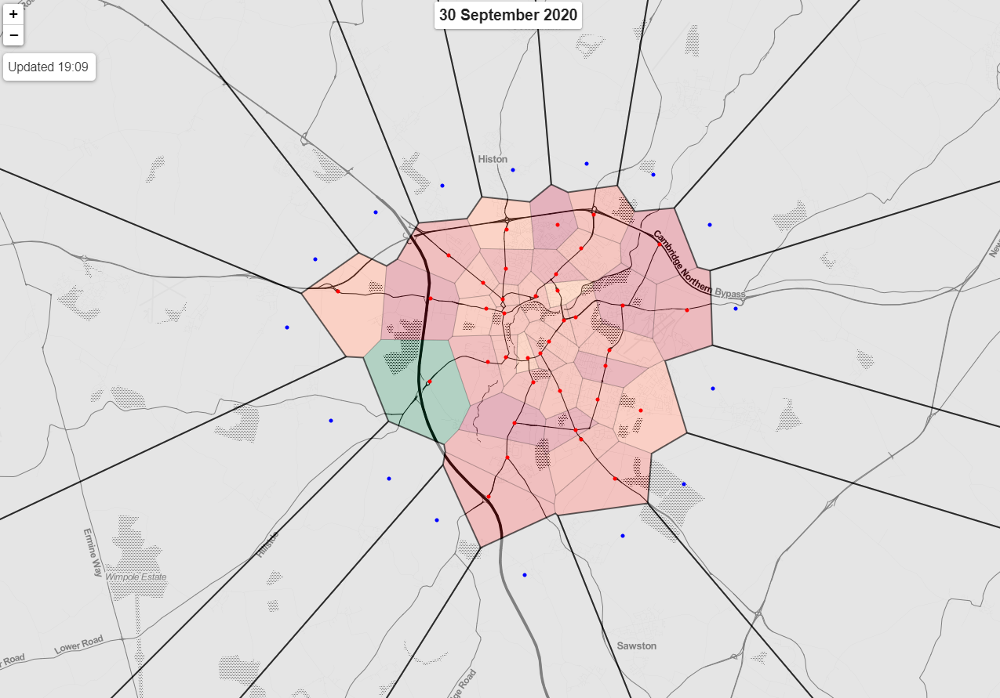

# VoronoiTraffic
### Cambridge traffic visualisation
 


### Data
The data is collected in real-time from 38 Bluetruth sensors deployed all around the city.
#### Types of data
* Route information
* Site metadata
* Link information
* Journey information
#### Data retrieval
* Most Recent
```javascript
const JOURNEY_URL = 'https://tfc-app1.cl.cam.ac.uk/api/v1/traffic/btjourney/latest/';

async function load_journeys() {
    return await d3.json(JOURNEY_URL, {
        headers: new Headers({
            "Authorization": `Token ` + API_TOKEN
        }),
    })
}
```

* Historical
```javascript
const JOURNEY_URL_HIST="https://tfc-app1.cl.cam.ac.uk/api/v1/traffic/btjourney/history/"

async function historical_link(link_id, date1, date2) {
    return await d3.json(

      JOURNEY_URL_HIST + link_id +
      "/?start_date=" + date1 + "&end_date" + date2, {
        headers: new Headers({
          "Authorization": `Token` + API_TOKEN
        }),
      })
  
```
##### More on this in async_functions.js and Hud.js

### Objects
The main classes are:

* VoronoiViz.js
* SiteDB.js
* Nodes.js
* Hud.js
* VizTools.js

### VoronoiViz
The main visualisation object responsible for instantiating all other classes and drawing the Voronoi diagram on the screen.

The visualisation draws a Voronoi diagram that shows a total of 38 sensors and their collected traffic data that we transform into speed deviation differences for different areas in the city.

To best read the ReadMe it's important to establish a common vocabulary, specifically what we refer to when saying *Cells, Nodes, and Links* withing the **VoronoiViz** context.


* Node - a sensor itself with its location in lat/lng
* Cell - an area that is denoted for a single Node in the Voronoi diagram
* Link - a route connecting two *Nodes*
* Zone - an entity comprised of a list of *Nodes* based on their geographical position in Cambridge (*North, East, West etc.*)
* Bar Chart - a chart on the right side showing the average speed for all *Nodes* in one of the 5 *Zones*
* Line Graph - a graph on the bottom left corner showing the link speeds for a selected *Node*

The visualisation can also color the cells not only based on the *Nodes'* speed deviation but also their current and historical speeds, however it tends to provide less information as some *Nodes* have missing data resulting in gray patches (in speed deviation we simply show that the deviation is 0). Furthermore, some *Nodes* e.g. ones in the West zone, will always show highest speeds (due to M11) and thus will forever remain coloured green.

#### SiteDB, Nodes, and Hud

(Open the raw file to zoom in)

### VizTools
Comprised of a combination of useful javascript functions and a number of constants that are used throughout all other classes.

### Suplementary files
Supplementary files:

* async_functions.js
* dijkstra.js
* boundary_sites.js
* cell_groups.js

#### async_functions.js
Comprises all main async functions that interact with the ACP API.  
```javascript
async function load_journeys() {
    ...
}  
async function load_links() {
    ...
}  
async function load_routes() {
    ...
}  
async function load_sites() {
    ...
}
```
The functions above are then used by the **SiteDB** object to instantiate and update all **Node** objects:   
```javascript
 async load_api_data(voronoi_viz) {

        await Promise.all([load_sites(), load_routes(), load_links(), load_journeys()]).then((combined_api_reponse) => {
            ...//cleaning and restructuring
        })};
```
#### dijkstra.js
Runs the shortest path algorithm between any selected two *Nodes* and draws the shortest path on screen.  
The shortest path is determined by the *travelTime* property of the *Node*, which becomes the edge weight in a directed graph.  


Users can find their shortest path between any two *Nodes* by double-clicking on them.  
Shortest paths between two *Nodes* often are different based on which one is the *start node* and which one is the *finish node*.   
#### boundary_sites.js  
A Data file for invisible cells that stop the Voronoi diagram from triangulating to infinity.  

We create a total of 16 additional *Nodes* that have no data (shown in blue) and hide them so that the *Nodes* and the drawn *Cells* tightly fit and end around the city perimeter.

#### cell_groups.js  
A Data file that selects what *Nodes* belong to what *Zone* - *North, South, East, West or Center*.  

### Run

```
git clone https://github.com/jb2328/VoronoiTraffic.git
cd VoronoiTraffic
python3 -m venv venvonoi
source venvonoi/bin/activate
python3 -m pip install pip --upgrade
python3 -m pip install wheel
python3 -m pip install -r requirements.txt
bash run.sh
open localhost:6400
```


